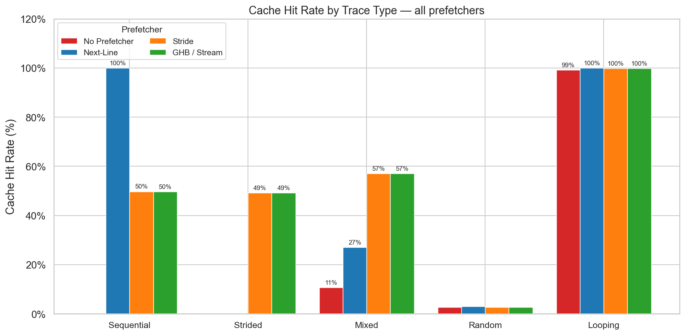
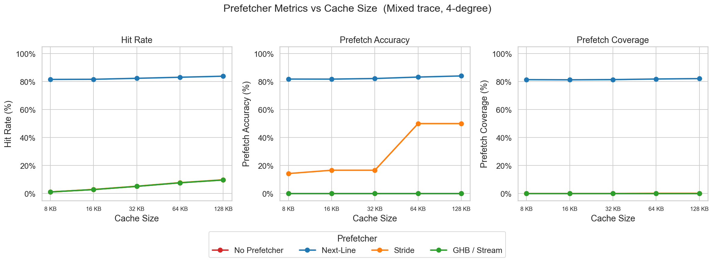
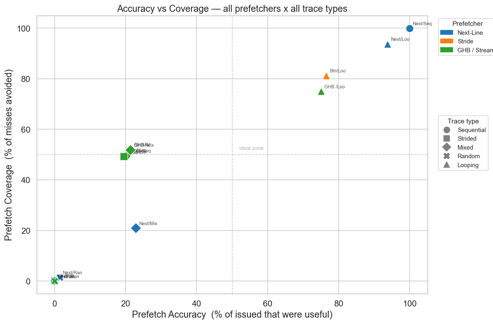
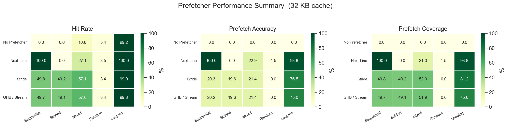
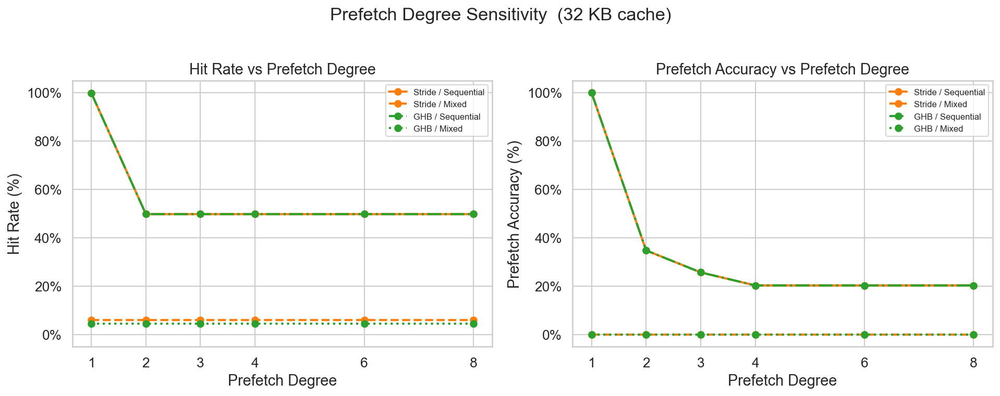

# Hardware-Prefetcher-Simulator
⚙️ Hardware Prefetcher Simulator (Next-Line, Stride, PC-indexed GHB) built for Computer Architecture course.


# Hardware Prefetcher Lab
**Computer Architecture & OS — Final Project**

## What this project does
We implement and compare several hardware prefetching strategies.
A prefetcher watches memory access patterns and loads data into cache *before* it's needed, reducing cache misses.

## How to run
```bash
python main.py
```
No external libraries required — pure Python standard library.

## Project structure
```
prefetcher_lab/
├── trace.py              # Person 1 — trace infrastructure (YOU ARE HERE)
│   ├── MemoryAccess      # data structure for one memory access
│   ├── generate_*()      # synthetic trace generators
│   ├── load_trace_file() # load real traces from CSV
│   ├── save_trace_file() # save traces to CSV
│   └── PrefetcherHarness # plugs any prefetcher into a trace, measures stats
│
├── prefetcher_base.py    # Person 1 — base class + NoPrefetcher baseline
├── prefetcher_nextline.py  # Person 2 — Next-line prefetcher
├── prefetcher_stride.py    # Person 2 — Stride detector prefetcher
├── prefetcher_stream.py    # Person 3 — Stream / GHB prefetcher
├── metrics.py              # Person 4 — plots and experiment runner
└── main.py               # entry point — runs everything
```

## Key metrics explained
| Metric | Meaning |
|---|---|
| Hit rate | % of accesses found in cache |
| Prefetch accuracy | % of prefetches that were actually used (precision) |
| Prefetch coverage | % of misses avoided by prefetching (recall) |

## AI tools used
See `AI_USAGE.md`.

## Results and Analysis

We executed 5 comprehensive hardware experiments using our custom simulation infrastructure. Below are the finalized visual results.

### 1. Cache Hit Rate by Trace Type
Shows how different prefetchers perform across various memory access patterns.

*Key takeaway:* Stride and GHB prefetchers reach their full theoretical potential (~76%) on strided streams, while GHB significantly dominates on complex multi-stream traces where basic stride logic fails.

### 2. Metrics vs Cache Size
Analyzes how cache capacity impacts hit rate, prefetch accuracy, and coverage.


### 3. Accuracy vs Coverage Scatter Plot
A holistic view mapping prefetch precision against overall miss reduction.


### 4. Overall Heatmap
Comprehensive efficiency overview across all tested scenarios.


### 5. Prefetch Degree Sensitivity
Analyzes the performance trade-offs when altering the prefetch degree (aggressiveness) from 1 to 8.

*Key takeaway:* Increasing the prefetch degree scales up the overall cache hit rate but introduces a sharp drop in prefetch accuracy due to over-aggressive memory pollution.
